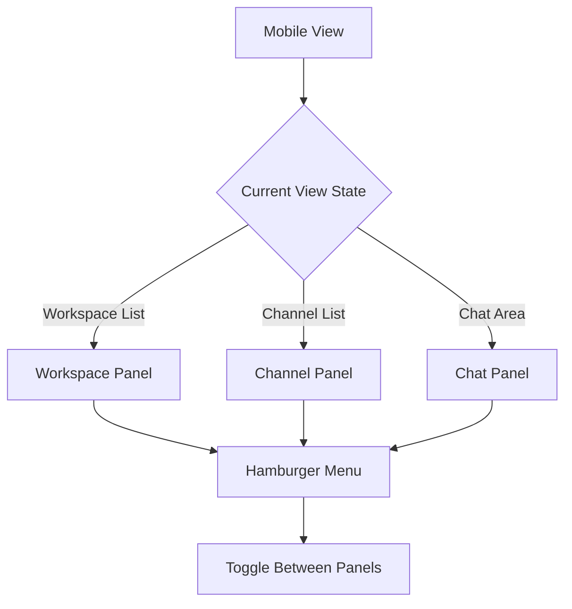
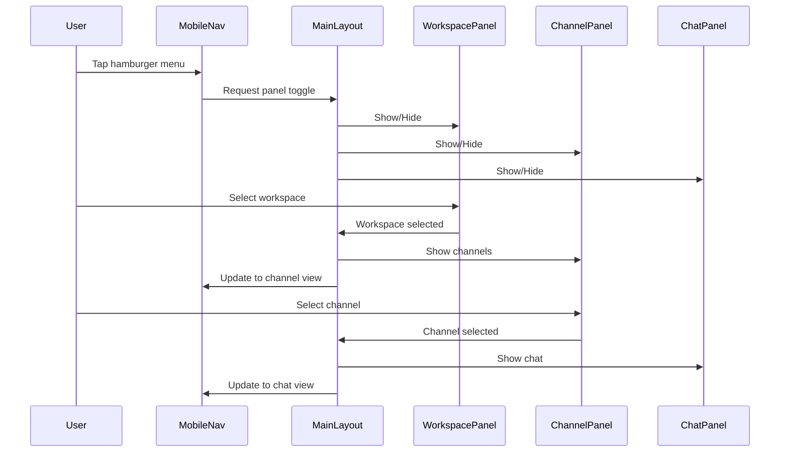

# Mobile Responsive Design Plan

## Problem Statement
The chat interface disappears on mobile devices. Users can only see:
- User profile pill (fixed positioned)
- Sidebar (workspace icons)
- No channel list or chat area visible

## Root Cause Analysis
The current layout in [`MainLayout.razor`](../SharpTalk.Web/Layout/MainLayout.razor) and [`MainLayout.razor.css`](../SharpTalk.Web/Layout/MainLayout.razor.css) only has responsive styles for desktop screens (`@media (min-width: 641px)`). Mobile screens (< 641px) lack proper styling, causing:
- Layout defaults to flex column without proper sizing
- Sidebar and channel sidebar have fixed heights (100vh) that cause overflow
- Main content (chat area) is pushed off-screen or hidden
- User profile pill remains visible due to `position: fixed` with high z-index

## Solution: Discord-like Mobile Navigation

### Architecture Overview



### Mobile View States

1. **Workspace List View** - Shows workspace icons (default on mobile)
2. **Channel List View** - Shows channels for selected workspace
3. **Chat Area View** - Shows messages and input for selected channel

### Navigation Flow



## Implementation Plan

### 1. Mobile-Specific CSS Media Queries

**File:** [`SharpTalk.Web/Layout/MainLayout.razor.css`](../SharpTalk.Web/Layout/MainLayout.razor.css)

Add mobile styles for screens below 641px:

```css
@media (max-width: 640.98px) {
    .page {
        flex-direction: column;
        height: 100vh;
        overflow: hidden;
    }

    .sidebar {
        width: 100%;
        height: 100%;
        position: absolute;
        top: 0;
        left: 0;
        z-index: 100;
        transform: translateX(-100%);
        transition: transform 0.3s ease;
    }

    .sidebar.mobile-visible {
        transform: translateX(0);
    }

    .channel-sidebar {
        width: 100%;
        height: 100%;
        position: absolute;
        top: 0;
        left: 0;
        z-index: 90;
        transform: translateX(-100%);
        transition: transform 0.3s ease;
    }

    .channel-sidebar.mobile-visible {
        transform: translateX(0);
    }

    main {
        width: 100%;
        height: 100%;
        position: relative;
    }

    .content {
        width: 100%;
        height: 100%;
    }

    .chat-area {
        width: 100%;
        height: 100%;
    }

    .user-profile-container {
        bottom: 16px;
        left: 16px;
        right: 16px;
        max-width: none;
    }

    .user-profile {
        max-width: none;
    }
}
```

### 2. Mobile Navigation Component

**File:** `SharpTalk.Web/Shared/MobileNavigation.razor` (new file)

Create a component with:
- Hamburger menu button
- Back button (when not in workspace view)
- Current view indicator
- Panel toggle functionality

```razor
<div class="mobile-nav">
    @if (CurrentView != MobileView.WorkspaceList)
    {
        <button class="nav-btn back-btn" @onclick="GoBack" title="Back">
            <svg xmlns="http://www.w3.org/2000/svg" viewBox="0 0 24 24" fill="none" stroke="currentColor" stroke-width="2">
                <path d="M19 12H5M12 19l-7-7 7-7"/>
            </svg>
        </button>
    }

    <div class="nav-title">@GetViewTitle()</div>

    <button class="nav-btn menu-btn" @onclick="ToggleMenu" title="Menu">
        <svg xmlns="http://www.w3.org/2000/svg" viewBox="0 0 24 24" fill="none" stroke="currentColor" stroke-width="2">
            <line x1="3" y1="12" x2="21" y2="12"/>
            <line x1="3" y1="6" x2="21" y2="6"/>
            <line x1="3" y1="18" x2="21" y2="18"/>
        </svg>
    </button>
</div>
```

### 3. Mobile View State Management

**File:** [`SharpTalk.Web/Layout/MainLayout.razor`](../SharpTalk.Web/Layout/MainLayout.razor)

Add state management:

```csharp
public enum MobileView
{
    WorkspaceList,
    ChannelList,
    ChatArea
}

private MobileView currentMobileView = MobileView.WorkspaceList;
private bool isMobile = false;

protected override async Task OnAfterRenderAsync(bool firstRender)
{
    if (firstRender)
    {
        await CheckMobileView();
    }
}

private async Task CheckMobileView()
{
    var isMobileView = await JSRuntime.InvokeAsync<bool>("isMobile");
    if (isMobileView != isMobile)
    {
        isMobile = isMobileView;
        StateHasChanged();
    }
}

private void SetMobileView(MobileView view)
{
    currentMobileView = view;
    StateHasChanged();
}

private void GoBack()
{
    switch (currentMobileView)
    {
        case MobileView.ChatArea:
            SetMobileView(MobileView.ChannelList);
            break;
        case MobileView.ChannelList:
            SetMobileView(MobileView.WorkspaceList);
            break;
    }
}
```

### 4. Modify MainLayout for Mobile Panels

**File:** [`SharpTalk.Web/Layout/MainLayout.razor`](../SharpTalk.Web/Layout/MainLayout.razor)

Update the authenticated section:

```razor
@if (IsAuthenticated)
{
    @if (isMobile)
    {
        <MobileNavigation CurrentView="currentMobileView" OnBack="GoBack" />
    }

    <div class="sidebar @(isMobile && currentMobileView == MobileView.WorkspaceList ? "mobile-visible" : "")">
        <!-- Existing sidebar content -->
    </div>

    <UserProfile />

    <div class="channel-sidebar @(isMobile && currentMobileView == MobileView.ChannelList ? "mobile-visible" : "")">
        <!-- Existing channel sidebar content -->
    </div>

    <main class="@(isMobile && currentMobileView == MobileView.ChatArea ? "mobile-visible" : "")">
        <article class="content px-4">
            <!-- Existing main content -->
        </article>
    </main>
}
```

### 5. Update Workspace/Channel Selection Handlers

Modify handlers to update mobile view state:

```csharp
private async Task HandleWorkspaceSelected(int workspaceId)
{
    ActiveWorkspaceId = workspaceId;
    // ... existing logic ...

    if (isMobile && workspaceId > 0)
    {
        SetMobileView(MobileView.ChannelList);
    }

    StateHasChanged();
}

private async void HandleChannelSelected(ChannelDto channel)
{
    CurrentChannel = channel;
    // ... existing logic ...

    if (isMobile)
    {
        SetMobileView(MobileView.ChatArea);
    }

    StateHasChanged();
}
```

### 6. Add JavaScript Helper

**File:** `SharpTalk.Web/wwwroot/js/mobile.js` (new file)

```javascript
export function isMobile() {
    return window.innerWidth <= 640;
}

window.addEventListener('resize', () => {
    // Notify Blazor of resize if needed
});
```

### 7. Update UserProfile Positioning

**File:** [`SharpTalk.Web/wwwroot/css/app.css`](../SharpTalk.Web/wwwroot/css/app.css)

Adjust user profile for mobile:

```css
@media (max-width: 640.98px) {
    .user-profile-container {
        bottom: 16px;
        left: 16px;
        right: 16px;
        max-width: none;
    }

    .user-profile {
        max-width: none;
    }
}
```

### 8. Add Transitions and Animations

**File:** [`SharpTalk.Web/Layout/MainLayout.razor.css`](../SharpTalk.Web/Layout/MainLayout.razor.css)

Add smooth transitions:

```css
@media (max-width: 640.98px) {
    .sidebar,
    .channel-sidebar,
    main {
        transition: transform 0.3s ease, opacity 0.3s ease;
    }

    .sidebar.mobile-hidden,
    .channel-sidebar.mobile-hidden,
    main.mobile-hidden {
        opacity: 0;
        pointer-events: none;
    }
}
```

## Testing Checklist

- [ ] Test on mobile devices (iOS Safari, Chrome Mobile)
- [ ] Test on tablet devices (portrait and landscape)
- [ ] Test panel transitions and animations
- [ ] Test back button navigation
- [ ] Test workspace/channel selection flow
- [ ] Test chat functionality on mobile
- [ ] Test user profile dropdown on mobile
- [ ] Test modals on mobile
- [ ] Test file upload on mobile
- [ ] Test orientation changes

## Edge Cases to Handle

1. **Orientation Change**: Detect and adjust mobile view state
2. **Deep Links**: Handle direct channel/workspace links on mobile
3. **Keyboard Open**: Adjust layout when virtual keyboard is open
4. **Modal Open**: Ensure modals work correctly on mobile
5. **Browser Back Button**: Consider integrating with browser history

## Performance Considerations

- Use CSS transforms instead of display:none for smooth animations
- Lazy load content for non-visible panels
- Debounce resize events
- Use hardware acceleration for animations

## Future Enhancements

1. Swipe gestures for panel navigation
2. Bottom navigation bar as alternative to hamburger menu
3. Persistent navigation state across page reloads
4. Tablet-specific layout (between mobile and desktop)
5. PWA support for mobile app-like experience
