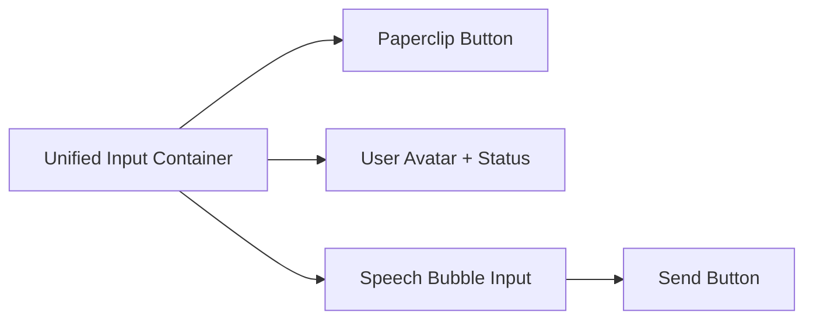

# Mobile UI Redesign Plan

## Goals
1.  **Workspaces Menu**: Transform the mobile workspace list from a simple icon strip into a more descriptive and user-friendly list.
2.  **Chat Input**: Redesign the chat input area into a unified "speech bubble" style component including:
    *   Attachment button (paperclip).
    *   User presence indicator (avatar + status).
    *   Speech bubble text input.
3.  **Animations**: Add a "fly" animation when sending messages, where the message appears to move from the input area into the chat history.

## Proposed Changes

### 1. Workspaces Menu (`Sidebar.razor` & `app.css`)
*   **HTML**: Update `Sidebar.razor` to include workspace names. Use a conditional or CSS to show/hide names based on screen size.
*   **CSS**: 
    *   On mobile, change `.workspace-list` to a full-width list.
    *   Increase padding and font sizes for better touch interaction.
    *   Ensure the "active" indicator is prominent.

### 2. Chat Input Redesign (`ChatArea.razor` & `app.css`)
*   **Logic**:
    *   Inject `UserService` to get `CurrentUser`.
    *   Use `UrlUtilityService` for avatar URLs.
*   **HTML**:
    ```html
    <div class="unified-chat-input">
        <label class="attach-btn">...</label>
        <div class="user-presence">
            
        </div>
        <div class="speech-bubble-input">
            <input ... />
            <button type="submit" class="send-btn">...</button>
        </div>
    </div>
    ```
*   **CSS**:
    *   Style `.speech-bubble-input` with rounded corners and a "tail" pointing towards the avatar.
    *   Ensure the paperclip and avatar are vertically aligned with the bubble.

### 3. 'Fly' Animation
*   **Logic**: When a message is sent, add a temporary CSS class to the new message item.
*   **CSS**:
    *   Define a `@keyframes fly-in` animation.
    *   The animation will start from a `translateY` offset (matching the distance from the input area) and move to `translateY(0)`.
    *   Add a slight scale or opacity transition for a smoother effect.

## Mermaid Diagram: Chat Input Structure


## Verification Plan
*   Open the app in mobile view (using browser dev tools).
*   Navigate to the Workspaces list and verify the new layout.
*   Go to a chat and verify the redesigned input area.
*   Send a message and observe the "fly" animation.
